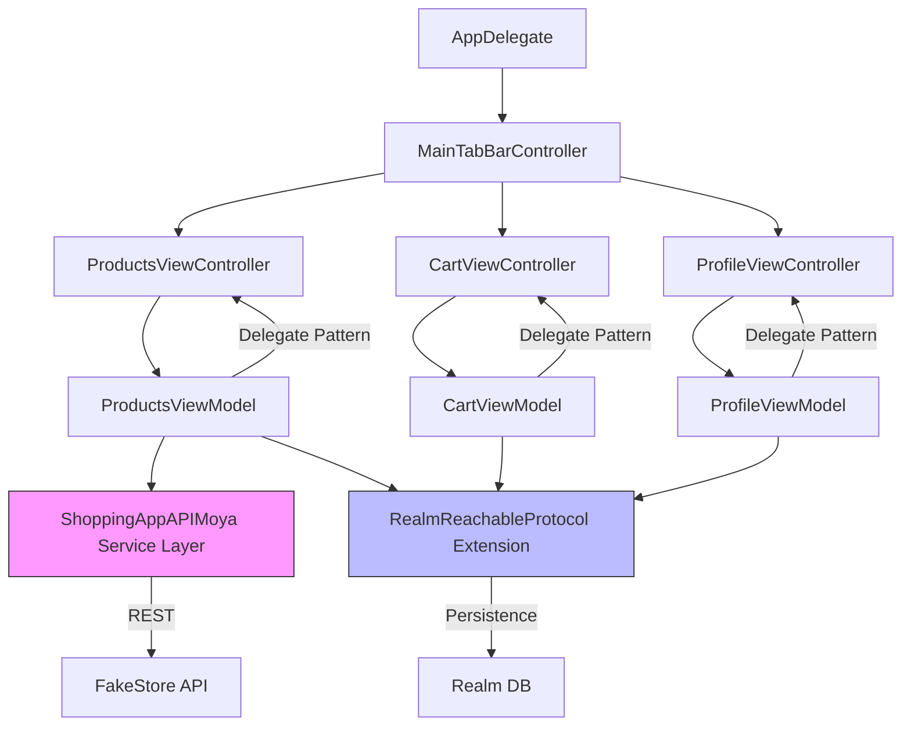

# ShoppingApp


An e-commerce iOS app where users can browse products, view details, manage a shopping cart, and place orders. Built as the final project for the **Patika.dev Pazarama iOS Bootcamp** (Oct – Nov 2022). All UI is written programmatically with UIKit and SnapKit — no storyboards.

## Screenshots

| Sign In | Sign Up | Products & Details | Cart & Checkout | Profile |
|---|---|---|---|---|
|  |  |  |  |  |

## Tech Stack

| Category | Tools |
|---|---|
| **Language** | Swift 5.7 |
| **UI** | UIKit (programmatic), SnapKit |
| **Architecture** | MVVM, Delegate pattern, Protocol-Oriented Programming |
| **Networking** | Moya (FakeStore API) |
| **Persistence** | Realm |
| **Image Loading** | Kingfisher |
| **Auth & Backend** | Firebase |
| **Dependency Management** | Swift Package Manager |

## Architecture



```
ShoppingApp/
├── App/
│   ├── Core/Protocols/       # RealmReachable protocol (DI via protocol extensions)
│   └── Delegates/            # AppDelegate
├── Screens/
│   ├── Authentication/       # Sign in / Sign up (Firebase Auth)
│   ├── Launch/               # Splash screen
│   ├── Products/             # Product listing, detail, add-to-cart
│   ├── Cart/                 # Cart management & checkout
│   ├── Profile/              # User profile & sign out
│   └── Main/                 # TabBarController
└── ShoppingAppAPI/           # Separate module — Moya service layer
```

Each screen follows **MVVM**: `View` (programmatic UIKit) → `ViewController` → `ViewModel`. ViewModels communicate with ViewControllers via the **delegate pattern**. Data persistence is abstracted through the `RealmReachable` protocol, injected via protocol extensions.

> For a detailed breakdown of architectural decisions, see [ARCHITECTURE.md](ARCHITECTURE.md).

## Prerequisites

- Xcode 14+
- iOS 15+
- Swift 5.7

## Installation

```bash
git clone https://github.com/emiralpduman/ShoppingApp.git
cd ShoppingApp
open Shopping\ App.xcworkspace
```

All dependencies are resolved automatically via Swift Package Manager.

## Setup

This app requires a Firebase project for authentication. The `GoogleService-Info.plist` file is **not** included in the repository for security reasons.

1. Go to the [Firebase Console](https://console.firebase.google.com/) and create a new project (or use an existing one).
2. Add an iOS app with your bundle identifier.
3. Download the generated `GoogleService-Info.plist` file.
4. Place it at:
   ```
   Shopping App/App/Plists/GoogleService-Info.plist
   ```
5. Build and run. The plist is gitignored and will not be committed.

> See `GoogleService-Info-example.plist` in the same directory for the expected structure.

## License

Distributed under the MIT License.

## Contact

Emiralp Duman — [LinkedIn](https://linkedin.com/in/emiralp-duman) — emiralpduman@gmail.com
